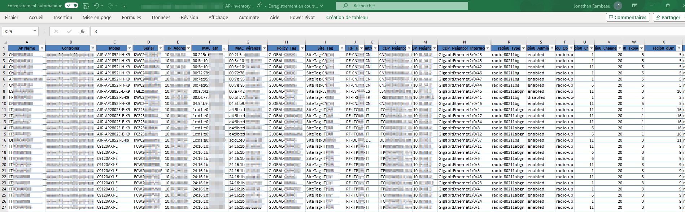

# AP Inventory for Cisco C9800 WLAN Controllers

This Python script connects to one or several Cisco Catalyst 9800 controllers and uses different RESTCONF API calls to export a comprehensive Access Points inventory file (csv and xls) containing models, IP address, MAC, LLDP/CDP neighbors information, radio status, etc...



Authors: Jonathan Rambeau

Date: 23 september 2024

Changelog:
- 21 feb 2024: added .csv to .xls
- 23 sept 2024: fixed an issue with 9124 AP

## 1. Installation

1. Install python
2. Check if pip is installed ``` python -m pip --version ```. If not installed, install it: https://pip.pypa.io/en/stable/installing/
3. Upgrade pip ``` python.exe -m pip install --upgrade pip ```
4. Install additionnal required libraries :
    1. ```pip install -r requirements.txt```
5. On the 9800 controller, enable the RESTCONF feature:
```
configure terminal
    aaa authorization exec default local 
    ip http secure-server
        restconf
```
6. Type in the IP address of the controller or controllers in file **devices_ip_list.txt**
```sh
1.2.3.4
5.6.7.8
```

## 2. Run the script

1. From a terminal, start the script: ``` python inventory_c9800_ap.py ```
2. You will be prompted for username and password
3. Inventory files are exported as .csv and .xls. There are located in the 'inventory' subdirectory
